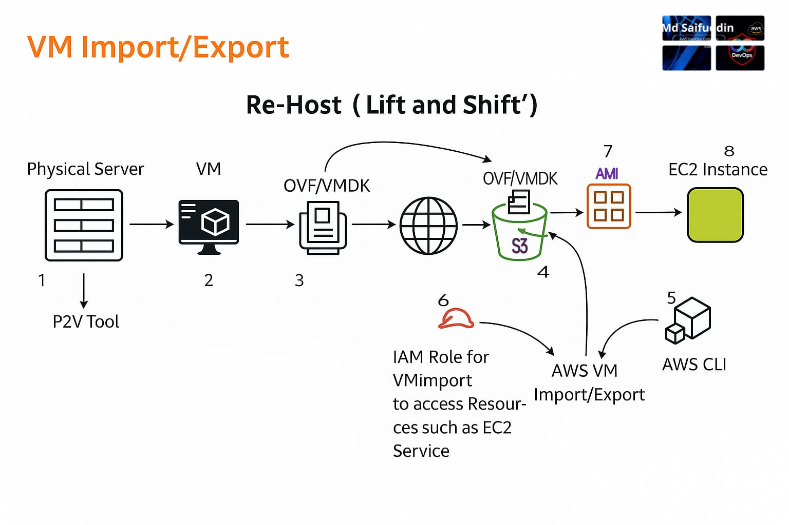

# Export VM from On-Premise to AWS

This guide explains how to export a virtual machine from on-premise (VMWare Workstation) and import it into AWS as an AMI.

---

## 1. Export Virtual Machine from On-Premise

1. Open **VMWare Workstation**.  
2. Select the virtual machine → **File** → **Export to OVF…**  
3. Choose the location to save the export file.  
4. Wait ~5 minutes for export to complete.  
5. The main file we will use is the **`.vmdk`** file.

---

## 2. Create S3 Bucket in AWS

1. Create an **S3 bucket** to store virtual machines.  
   - **Bucket name**: must be unique (e.g., `import-bucket-2025`).  
   - **Region**: choose appropriate AWS region.  
   - **Access**: Uncheck **Block all public access**.  
2. Click **Create bucket**.

---

## 3. Upload Virtual Machine to S3

- Upload the exported `.vmdk` file from step 1 into the S3 bucket.  
- Upload time depends on file size.

---

## 4. Create IAM Role for VM Import

1. Create a file `trust-policy.json` with the following content:

```json
{
   "Version": "2012-10-17",
   "Statement": [
      {
         "Effect": "Allow",
         "Principal": { "Service": "vmie.amazonaws.com" },
         "Action": "sts:AssumeRole",
         "Condition": {
            "StringEquals": {
               "sts:Externalid": "vmimport"
            }
         }
      }
   ]
}
```

2. Run the following command to create the IAM role:

```bash
aws iam create-role --role-name vmimport --assume-role-policy-document "file://trust-policy.json"
```

3. Verify the role is created.

---

## 5. Attach Role Policy

1. Create a file `role-policy.json` with the following content:

```json
{
   "Version":"2012-10-17",
   "Statement":[
      {
         "Effect": "Allow",
         "Action": [
            "s3:GetBucketLocation",
            "s3:GetObject",
            "s3:ListBucket" 
         ],
         "Resource": [
            "arn:aws:s3:::import-bucket-2025",
            "arn:aws:s3:::import-bucket-2025/*"
         ]
      },
      {
         "Effect": "Allow",
         "Action": [
            "s3:GetBucketLocation",
            "s3:GetObject",
            "s3:ListBucket",
            "s3:PutObject",
            "s3:GetBucketAcl"
         ],
         "Resource": [
            "arn:aws:s3:::export-bucket",
            "arn:aws:s3:::export-bucket/*"
         ]
      },
      {
         "Effect": "Allow",
         "Action": [
            "ec2:ModifySnapshotAttribute",
            "ec2:CopySnapshot",
            "ec2:RegisterImage",
            "ec2:Describe*"
         ],
         "Resource": "*"
      }
   ]
}
```

2. Attach the policy to the role:

```bash
aws iam put-role-policy --role-name vmimport --policy-name vmimport --policy-document "file://role-policy.json"
```

---

## 6. Import Virtual Machine to AMI

Run the following AWS CLI command:

```bash
aws ec2 import-image   --description "VM Image"   --disk-containers Format=vmdk,UserBucket="{S3Bucket=import-bucket-2025,S3Key=Ubuntu.vmdk}"
```

- Replace `Ubuntu.vmdk` with your exported VM file.  
- Import takes ~5–10 minutes depending on size.  
- Once complete, check the **AMI list** in EC2.  
- Ensure **EBS is not encrypted**.

---

## 7. Deploy EC2 Instance from AMI

- From the AWS Management Console, select the imported AMI.  
- Launch a new **EC2 instance** using this AMI.  

---

✅ You have successfully migrated a VM from **on-premise (VMWare)** to **AWS EC2**.
